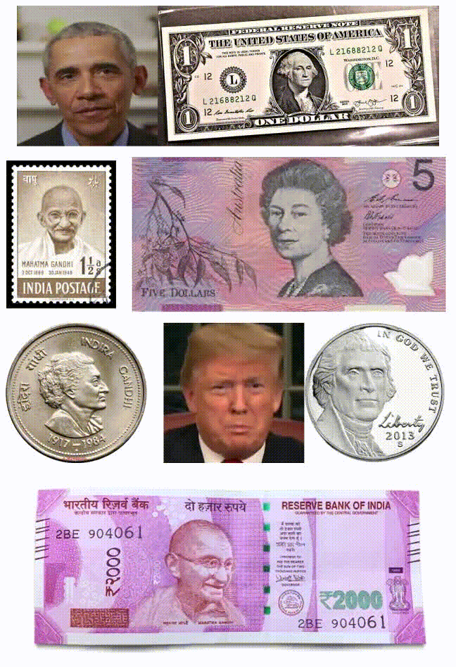

# moneyTalks
Implementation of harray potter magic using deep learning 

Courtesy:  
I used modules from, 
*   [face motion](https://github.com/AliaksandrSiarohin/first-order-model)
*   [face detection](https://github.com/the-house-of-black-and-white/hall-of-faces.git)
*   [face overlay](https://www.learnopencv.com/seamless-cloning-using-opencv-python-cpp/)
*   [opencv](https://opencv.org/)

## [demo](https://colab.research.google.com/github/vishnu-chand/moneyTalks/blob/master/moneyTalks.ipynb) for money talks

